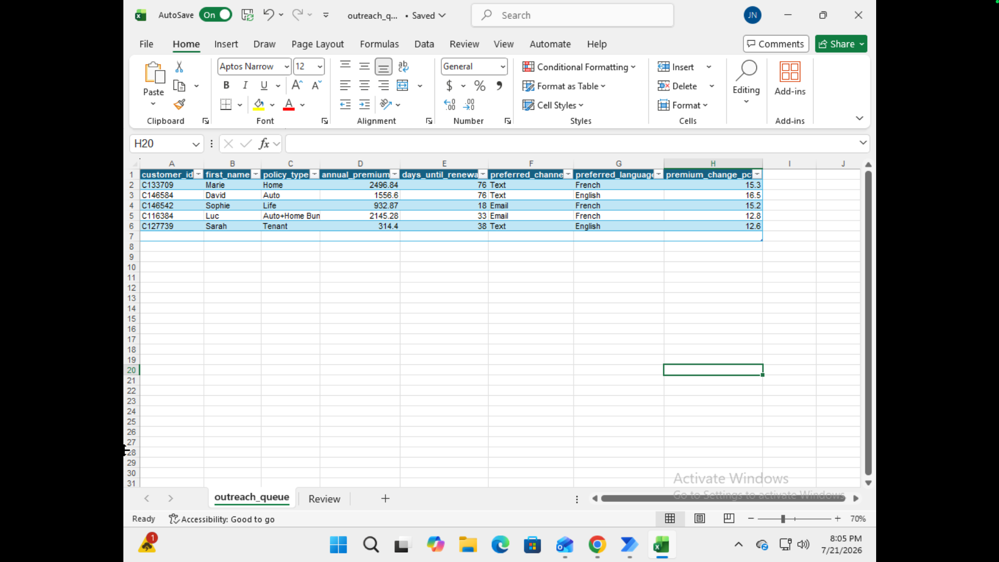

# Customer Retention and Automated Outreach System

This project simulates a retention risk system for a Canadian insurance company. Customer data is cleaned and scored using SQL in PostgreSQL, shown in a Power BI dashboard, and used to draft personalized outreach messages through the Claude API, automated with Power Automate and reviewed by a person before anything gets sent.

## Step 1: The Business Problem

Insurance companies lose customers every year without seeing it coming. Northstar Insurance (a fictional Canadian P&C insurer used for this project) had no systematic way to tell which policyholders were about to lapse, so retention efforts were reactive, generic, or didn't happen at all.

The goal: predict which policyholders are at risk of not renewing, and give retention agents a clear, prioritized way to reach out before it's too late.

Historical data shows about 9.1% of policyholders lapse at renewal. This project identifies the ones most likely to leave and shows exactly how much premium is on the line.

## Step 2: The Technical Approach

The dataset is 50,000 synthetic policyholder records, plus 15,000 historical renewals used to check the scoring logic against real outcomes.

Instead of machine learning, this uses a transparent, rules based scoring model. Each risk factor, missed payments, a denied claim, a large premium increase, and so on, adds points, and the total determines a customer's risk tier. Tested against historical data, high-risk customers lapsed at more than four times the rate of low-risk customers, so the rules hold up.

**Tools:** PostgreSQL, Python, SQL, Power BI, Power Automate, and the Claude API for drafting outreach.

## Step 3: Architecture and Operations

Data moves through three layers in PostgreSQL, following a bronze, silver, gold pattern:

- **Bronze** (`raw_current_book`): the raw data, exactly as it came in
- **Silver** (`clean_current_book`): duplicates removed, formatting fixed, bad records set aside for review instead of deleted
- **Gold** (`scored_current_book`): every policyholder scored and sorted into a risk tier, ready for the dashboard

The scoring rules were validated against 15,000 real historical renewals before ever being applied to the current book.

Right now, the pipeline and outreach flow run manually, five customers at a time, as a demo. In production, this would run on a schedule against the full customer base. Data quality is monitored automatically too: if more than 1% of a batch fails validation, that's flagged for review rather than quietly ignored.

For outreach: a Power Automate flow reads the highest-priority customers, uses the Claude API to draft a personalized message for each one in their preferred language and channel, and puts every draft in front of a person for approval. Nothing sends without a human saying yes.

The customers going into the flow:

The drafted messages, waiting for approval:

## Project structure

- `sql/` — cleaning and scoring scripts
- `data/` — sample bronze, silver, and gold CSVs, data dictionary, and the generator script
- `docs/` — business requirements, functional and non-functional requirements, user stories
- `dashboard/` — dashboard demo
- `automation/` — Power Automate flow and outreach demo

## A note on the data

The dataset is synthetic and self-generated, built with realistic churn drivers so the scoring rules could be tested against known outcomes. All company names are fictional.

**Author:** Joseph Nevin (Jobin), Business Systems Analyst, ECBA
